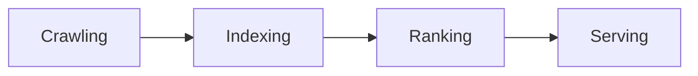
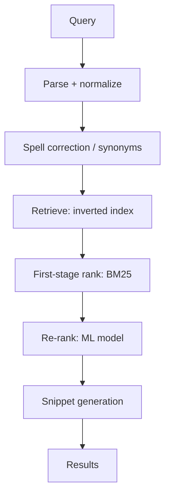
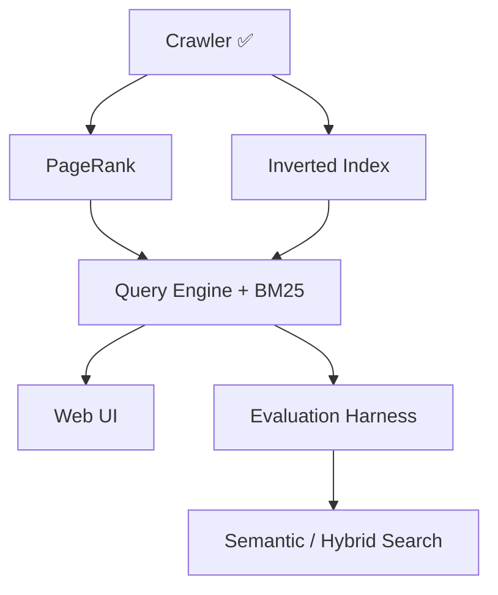

# Search Engines — Theory, This Project, and the Road Ahead

> [!info] Scope
> Part 1 is general search-engine theory. Part 2 dissects the crawler in this repo.
> Part 3 is the build order for everything still missing.

---

# Part 1 — How Search Engines Work

## The four stages

Every large-scale search engine, from Google to a toy project, is the same pipeline:



1. **Crawling** — discover and download pages.
2. **Indexing** — turn documents into a data structure supporting fast lookup.
3. **Ranking** — order matching documents by relevance and quality.
4. **Serving** — parse the query, retrieve, rank, and return results with low latency.

Stages 1–2 are **offline** (batch, throughput-bound). Stages 3–4 are **online**
(per-query, latency-bound, budget ~100–200 ms). This split drives nearly every design
decision: anything expensive gets precomputed offline.

---

## Stage 1 — Crawling

A crawler is a graph traversal over the web, where nodes are URLs and edges are hyperlinks.

**Core loop:** take a URL from the *frontier*, fetch it, extract text and links, store, push
new links back onto the frontier. It is BFS with a queue (DFS with a stack is a mistake —
it burrows into one site and never achieves breadth).

**The hard problems:**

- **Politeness.** Hitting one host with 50 parallel requests is a denial-of-service. You must
  obey `robots.txt` (RFC 9309) and rate-limit *per host*, not globally.
- **Deduplication.** The same content is reachable via many URLs (`?utm_source=`, `www.` vs
  bare, trailing slashes, session IDs). Without **URL normalization** + **content hashing**,
  the index fills with duplicates and ranking degrades.
- **Traps.** Infinite calendars (`/calendar?day=N` forever), session-ID loops, and deliberate
  spider traps. Depth limits and per-domain page caps defend against these.
- **Freshness.** The web changes; a crawl is a snapshot. Real engines recrawl on a schedule
  weighted by observed change rate.
- **Scale.** Billions of URLs means the "visited" set cannot live in RAM. Production systems
  use Bloom filters (accepting a small false-positive rate) or sharded on-disk stores.

**Termination is subtle.** In a concurrent crawler, an empty queue does *not* mean "done" —
workers may be mid-fetch and about to enqueue more. You need a counter of in-flight work.
This is the single most common concurrency bug in crawler implementations.

---

## Stage 2 — Indexing

### The inverted index

A **forward index** maps document → terms. Useless for search: answering "who contains
'python'?" means scanning every document.

An **inverted index** flips it — term → list of documents:

```
"python"  → [doc3, doc17, doc42, ...]
"crawler" → [doc7, doc17, ...]
```

Query `python AND crawler` becomes an **intersection of two sorted lists** — linear in
posting-list length, not corpus size. This is *the* foundational data structure of search.

Each entry is a **posting**, typically carrying more than a doc ID:

```
term → [(docID, term_frequency, [positions...]), ...]
```

Positions enable **phrase queries** ("machine learning" as an adjacent pair, not two
scattered words).

### Text processing pipeline

Before indexing, raw text is normalized:

| Step | Purpose | Example |
|---|---|---|
| Tokenization | Split into terms | `"Don't stop"` → `["don't", "stop"]` |
| Lowercasing | Case-insensitive matching | `Python` → `python` |
| Stopword removal | Drop `the`, `is`, `a` | Shrinks index; hurts phrase queries |
| Stemming | Reduce to root | `running`, `runs` → `run` (Porter stemmer) |
| Lemmatization | Dictionary root | `better` → `good` (slower, more accurate) |

**Critical rule:** the query must go through the *exact same* pipeline as the documents,
or terms won't match.

### Compression

Posting lists are huge. Two standard tricks:
- **Delta encoding** — store gaps `[3, 14, 28]` instead of IDs `[3, 17, 45]`. Smaller numbers.
- **Variable-byte / Elias-Gamma encoding** — small numbers use fewer bytes.

---

## Stage 3 — Ranking

Ranking splits into **query-dependent** relevance and **query-independent** quality.

### Query-dependent: TF-IDF and BM25

**TF-IDF** balances two intuitions:
- *Term Frequency* — a term appearing often in a document signals aboutness.
- *Inverse Document Frequency* — a term appearing in *every* document is uninformative.

$$
\text{tfidf}(t, d) = tf(t,d) \times \log\frac{N}{df(t)}
$$

**BM25** is the modern refinement and the practical default. It fixes two TF-IDF flaws:
term frequency **saturates** (the 50th occurrence adds little over the 10th), and it
**normalizes by document length** so long documents don't win by mere size.

$$
\text{BM25}(t,d) = IDF(t) \cdot \frac{tf \cdot (k_1+1)}{tf + k_1 \cdot (1 - b + b \cdot \frac{|d|}{avgdl})}
$$

Typical: $k_1 \approx 1.5$ (saturation), $b \approx 0.75$ (length normalization).

> [!tip] BM25 is the strong baseline
> It routinely beats naive neural approaches and remains the first-stage retriever in most
> production systems, including ones with heavy ML on top.

### Query-independent: PageRank

Brin and Page's insight, and Google's origin: **a link is a vote**. A page is important if
important pages link to it — a recursive definition solved as a fixed point.

$$
PR(u) = \frac{1-d}{N} + d \sum_{v \in B_u} \frac{PR(v)}{L(v)}
$$

Where $B_u$ = pages linking to $u$, $L(v)$ = outbound link count of $v$, and $d \approx 0.85$
is the **damping factor** — modelling a "random surfer" who follows links with probability
$d$ and teleports to a random page otherwise. Damping also solves **rank sinks** (pages with
no outbound links absorbing all rank).

Computed by **power iteration**: initialize all pages to $1/N$, apply the formula repeatedly,
converge in ~20–50 iterations. It requires the **full link graph** — which is exactly why a
crawler must store url → url edges, not just page text.

Related: **HITS** (hubs and authorities), and modern link-spam-resistant variants like
**TrustRank**.

### Other signals

Real engines combine hundreds: anchor text of inbound links (often describes the target
better than the target describes itself), freshness, click-through rate, dwell time, mobile
friendliness, page speed, HTTPS, spam scores.

### Learning to Rank

Modern systems use ML to *combine* signals. Retrieve top-1000 with BM25 (cheap), then
**re-rank** with a learned model (expensive but applied to few documents). Approaches:
pointwise, pairwise (RankNet), listwise (LambdaMART — still a very strong production
baseline). Neural rerankers now often use cross-encoder BERT models.

### Semantic / vector search

Keyword search fails on vocabulary mismatch — a query for "car" misses a document about
"automobile". **Dense retrieval** embeds queries and documents into a shared vector space
and retrieves by cosine similarity, using an ANN index (HNSW, FAISS, IVF-PQ).

**Hybrid search** — combining BM25 and vector scores, typically via Reciprocal Rank Fusion —
outperforms either alone and is the current standard.

---

## Stage 4 — Serving

Query flow within a ~100 ms budget:



**Optimizations that make this tractable:**
- **WAND / Block-Max WAND** — skip documents that provably can't reach the top-k.
- **Caching** — query result caches; query distributions are heavily Zipfian, so a small
  cache gets a high hit rate.
- **Sharding** — partition by document; every shard searches in parallel; merge top-k.
- **Tiering** — search a small high-quality index first; fall through to the full index only
  if results are insufficient.

**Snippets** are generated at query time from stored document text, selecting the passage
with the highest query-term density and highlighting matches.

---

## Evaluation

You cannot improve what you don't measure.

| Metric | Meaning |
|---|---|
| Precision@k | Fraction of top-k results that are relevant |
| Recall | Fraction of all relevant docs retrieved |
| MRR | Mean Reciprocal Rank — how high the first relevant result sits |
| **nDCG@k** | Discounted Cumulative Gain — graded relevance, position-discounted. **The standard.** |
| MAP | Mean Average Precision across queries |

Offline metrics need labeled judgments (TREC-style, or LLM-generated). Online, engines rely on
**A/B testing** and **interleaving**.

---

# Part 2 — This Project

## Current status

The **crawl-and-store layer is complete**. Indexing, ranking, and serving are not built yet —
that is Part 3.

## Layout

```
crawler/
├── config.py              # All tunables
├── main.py                # Thread pool, budgets, termination
├── core/
│   ├── frontier.py        # Thread-safe URL queue, dedup, resume
│   └── polite_check.py    # robots.txt + per-domain rate limiting
├── worker/
│   ├── fetcher.py         # HTTP: retries, streaming, size caps
│   └── parser.py          # Text/title extraction, URL normalization
├── storage/
│   └── indexer.py         # SQLite schema, transactional writes
├── tests/                 # ~45 unit tests
└── data/
    ├── crawler.db         # pages | links | frontier
    └── raw_html/          # Archived HTML, sharded by hash prefix
```

## Data model

```sql
pages(id, url UNIQUE, title, content, content_hash, status_code,
      content_length, depth, raw_html_path, crawled_at)

links(id, from_url, to_url, discovered_at, UNIQUE(from_url, to_url))

frontier(url PRIMARY KEY, status, depth, discovered_at)
```

- **`pages`** — one row per crawled document. `content_hash` (SHA-256) detects exact
  duplicates across mirrored URLs. `title` never blank: falls back `<title>` → `<h1>` →
  `og:title` → URL slug, because title is the highest-weighted ranking signal.
- **`links`** — **the web graph**, the input to PageRank. Edges are recorded for *discovered*
  targets even before those targets are crawled, so the graph stays complete at the frontier.
  Indexed on `to_url` because `UNIQUE(from_url, to_url)` serves outbound traversal via
  leftmost-prefix but cannot serve inbound.
- **`frontier`** — crawl state, enabling resume after interruption.

## Design decisions worth defending in an interview

> [!note] Termination detection
> An empty queue is not "done" — workers may be mid-fetch, about to enqueue more. The
> supervisor watches `queue.unfinished_tasks`, which counts dequeued-but-unfinished items.
> Each worker calls `task_done()` in a `finally` block placed **after** `add_urls()`. Place it
> earlier and the crawl terminates early; make it conditional and it never terminates.

> [!note] Rate limiting without convoying
> `wait_if_needed()` reserves a domain's next slot *while holding the lock*, then releases the
> lock *before sleeping*. Sleeping under the lock would serialize all domains behind one
> worker's nap, collapsing 8 workers to roughly single-threaded throughput.

> [!note] robots.txt fetching
> `RobotFileParser.read()` calls `urlopen()` with **no timeout** — a slow host hangs a worker
> forever. We fetch with `requests` under a timeout and feed text to `.parse()`. Failures
> allow-all per convention. Keyed by full host: `www.example.com` and `example.com` may serve
> different rules (RFC 9309).

> [!note] SQLite concurrency
> One connection, `check_same_thread=False`, WAL mode, one write lock. SQLite has no true
> concurrent writers, and writes take microseconds against fetches of hundreds of
> milliseconds — the lock is never the bottleneck. One transaction per page covers the page
> row, its links, and frontier updates, so a crash can't record a page without its edges, and
> a 200-link page costs 1 commit rather than 200.

> [!note] Two-layer content filtering
> The extension blocklist avoids spending a round-trip on obvious non-HTML. The
> `Content-Type` check in the fetcher — applied *before* reading the body — is authoritative.
> Defense in depth, not redundancy.

> [!note] URL normalization
> Lowercase host, strip default ports, drop fragments, remove tracking params, sort query
> string. Without it the frontier treats `?utm_source=twitter` as a distinct page and the link
> graph fills with duplicate nodes that distort any ranking computed over it.

## Useful queries

Inbound link counts — the raw signal PageRank refines:

```sql
SELECT to_url, COUNT(*) AS inbound
FROM links GROUP BY to_url ORDER BY inbound DESC LIMIT 20;
```

One PageRank iteration in pure SQL:

```sql
WITH outdegree AS (SELECT from_url, COUNT(*) AS n FROM links GROUP BY from_url)
SELECT l.to_url, 0.15 + 0.85 * SUM(1.0 / o.n) AS rank
FROM links l JOIN outdegree o ON l.from_url = o.from_url
GROUP BY l.to_url ORDER BY rank DESC LIMIT 20;
```

## Known limitations

- `visited` set is in-memory — at tens of millions of URLs, needs a Bloom filter.
- Single-process — distributing means partitioning the frontier by domain hash onto a shared
  queue (Redis/Kafka).
- `content_hash` catches exact duplicates only — near-duplicates want SimHash/MinHash.
- No JavaScript rendering — SPA content is invisible. Would need Playwright.

---

# Part 3 — Next Steps

## Phase 1 — PageRank (`ranking/pagerank.py`)

The link graph already exists, so this is immediately buildable and is the highest-value
next step: it is the algorithm the project's story is built around.

- Load edges from `links` into a sparse adjacency structure (`scipy.sparse`).
- Power iteration with damping $d = 0.85$, ~30 iterations or until L1 delta < 1e-6.
- Handle **dangling nodes** (no outbound links) by redistributing their rank uniformly.
- Persist to a `pagerank(url, score)` table.
- **Validate:** scores sum to 1.0; hub pages should rank top.

## Phase 2 — Inverted index (`indexer/`)

- Text pipeline: tokenize → lowercase → stopword removal → Porter stemming.
- Build `term → [(doc_id, tf, positions)]`.
- Store in SQLite (`terms`, `postings`) or serialize to `INDEX_PATH` — already reserved in
  `config.py`.
- Precompute and store document lengths and average document length (BM25 needs them).
- Consider SQLite's built-in **FTS5** as a baseline to benchmark your own implementation
  against — being able to say "mine is within X% of FTS5" is a strong interview data point.

## Phase 3 — Query engine (`search/`)

- Parse queries; support `AND`/`OR`/`NOT` and quoted phrases.
- Retrieve via posting-list intersection.
- Score with **BM25** ($k_1 = 1.5$, $b = 0.75$).
- **Combine signals:** `final = α · normalize(BM25) + β · normalize(PageRank)`. Tune α, β.
- Generate snippets by locating the highest query-term-density window in `pages.content`.

## Phase 4 — Interface

- FastAPI backend: `GET /search?q=...&page=N`.
- Minimal frontend — results with title, URL, highlighted snippet.
- Show query latency; it demonstrates you care about performance.

## Phase 5 — Evaluation

This is what separates a project from a *credible* project.

- Build a small labeled query set (30–50 queries, graded relevance).
- Report **nDCG@10**, MRR, Precision@10.
- **Ablation table** — BM25 alone vs. BM25 + PageRank vs. hybrid. Quantified improvements are
  exactly what interviewers probe for.
- Benchmark index size and query latency (p50/p95).

## Phase 6 — Stretch goals

Pick based on the story you want to tell:

- **Semantic search** — embed with `sentence-transformers`, index with FAISS/HNSW, fuse with
  BM25 via Reciprocal Rank Fusion. Currently the most in-demand skill of the set.
- **Learning to Rank** — LambdaMART over your labeled set.
- **Spell correction** — edit distance over the term dictionary; "Did you mean?"
- **Query autocomplete** — trie over the query log.
- **Distributed crawling** — Redis-backed frontier, multiple worker processes.
- **Near-duplicate detection** — SimHash with Hamming-distance bucketing.
- **Incremental recrawl** — schedule by observed change rate.

## Suggested order



Build **PageRank first** — the data is already there, it's self-contained, and it's the
component most tied to the project's narrative.

---

## Further reading

- Manning, Raghavan & Schütze, *Introduction to Information Retrieval* — free online, the standard text
- Brin & Page (1998), *The Anatomy of a Large-Scale Hypertextual Web Search Engine* — the original Google paper
- Robertson & Zaragoza (2009), *The Probabilistic Relevance Framework: BM25 and Beyond*
- Croft, Metzler & Strohman, *Search Engines: Information Retrieval in Practice*
