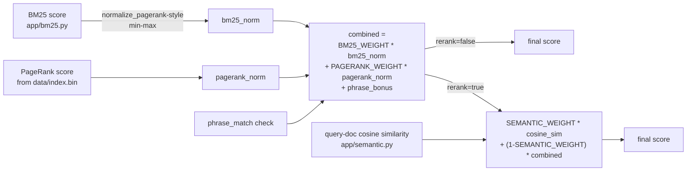

# ML architecture — how a query actually becomes a ranked list

Companion to `overview.md` (file-by-file roles, the synthetic-vs-real-data split) and
`current-state.md` (what's fit, what's tuned, what's deployed). This file is about shape: how a
query moves through parsing, retrieval, and ranking, and why the pipeline is built the way it
is. It intentionally does not repeat status/priority calls — see `current-state.md` and
`roadmap.md` for those. For where this pipeline sits inside the full 3-component system
(crawler → C++ index → this), see `../docs-sde/architecture.md`.

## The pipeline, end to end

```mermaid
flowchart TD
    Q[Raw query string] --> V[validate_query]
    V --> Cache{search_cache hit?}
    Cache -->|yes| Skip[skip straight to snippet<br/>generation on cache hit]
    Cache -->|no| SC[spellcheck.py<br/>correct_query]

    SC -->|unknown word,<br/>rerank=false| NoRes[NoResultsResponse<br/>-- dead end for lexical-only mode]
    SC -->|else| Mode{rerank flag}

    Mode -->|false| QP1[parse_query<br/>on corrected query]
    Mode -->|true| QP2[parse_query<br/>on RAW query]

    QP1 --> RC[retrieve_candidates<br/>boolean AND/OR/NOT + phrase filter]
    QP2 --> RC

    RC --> BM[score_documents_detailed<br/>BM25 + PageRank + phrase bonus]
    BM --> Sort[sort by -final_score, doc_id]

    Sort -->|rerank=false| Done1[ranked_ids, scores]
    Sort -->|rerank=true| Aug{allow_augmentation?<br/>no required/excluded/phrases}

    Aug -->|yes| AugYes[whole-corpus embedding<br/>similarity search --<br/>surfaces docs BM25 never found]
    Aug -->|no| AugNo[rerank existing<br/>candidates only]
    AugYes --> Blend[blend: SEMANTIC_WEIGHT * cosine<br/>+ (1-SEMANTIC_WEIGHT) * BM25/PageRank score]
    AugNo --> Blend
    Blend --> Done2[ranked_ids, scores,<br/>semantic_components]

    Done1 --> Dedup[dedup_results]
    Done2 --> Dedup
    Dedup --> Snip[build_snippet<br/>-- current page only]
    Skip --> Snip
    Snip --> Resp[SearchResponse:<br/>results + per-signal scores]
```

## Why `rerank=true` is a genuinely different retrieval path, not a toggle at the end

The most common mistake this architecture is designed to avoid: treating semantic search as
"run the normal pipeline, then reorder the top results by embedding similarity." That design
silently fails on the exact query semantic search exists for — a paraphrase sharing zero
vocabulary with its target documents (`ways machines can learn from data` vs. documents about
`machine learning`) — because there's nothing in a BM25-only candidate set to reorder in the
first place.

Two structural choices fix this, both visible in the diagram above:

1. **`rerank=true` retrieves against the raw query, not the spell-corrected one** (Phase 8).
   SymSpell "corrects" any word absent from this corpus's narrow vocabulary to the nearest
   in-corpus word within edit distance 2 — including perfectly valid English words the
   correction actively hurts. A semantic model handles real-world text, typos included, far
   better than edit-distance correction does and doesn't need the correction's help.
2. **Augmentation searches the whole corpus by embedding similarity, not just the BM25 top-K**
   (`allow_augmentation`, gated on whether the query has an explicit hard constraint —
   `required`/`excluded`/`phrases` — not on how many BM25 candidates exist). This is what lets a
   query with literally zero lexical matches still return relevant results: the augmented
   documents enter the ranked list with `bm25_score: null, pagerank_score: null`, which the
   frontend renders as a "found by meaning" badge rather than a fabricated zero.

## Scoring: three signals, fused, never silently faked



`score_documents_detailed()` (Phase 8) is the source of truth both for `final` and for each
component individually (`bm25`, `pagerank`, `phrase_bonus`) — `score_documents()` is now a thin
wrapper over it. This split exists entirely to serve the frontend's "why this result?" panel: a
signal that was never evaluated for a given document (a pure semantic-augmentation find has no
BM25 or PageRank opinion at all) renders as `n/a`, never as a fake `0.0` that would misrepresent
"never scored" as "scored and found irrelevant."

## The offline evaluation and fitting loop — a separate, parallel architecture

The runtime pipeline above serves real, live queries against the real crawled corpus
(`data/index.bin` via `cpp_index_reader.py`). A second, structurally similar but data-isolated
pipeline exists purely for evaluation and parameter fitting:

```mermaid
flowchart LR
    Corpus[data/corpus.json<br/>synthetic, template-generated] --> Judg[build_judgments<br/>40 queries, programmatic<br/>relevance labels]
    Corpus --> EvalPipe[scripts/evaluate.py<br/>mirrors the real /search<br/>code paths]
    Judg --> EvalPipe
    EvalPipe --> Metrics[P@10 / MRR / nDCG@10<br/>split: lexical vs. semantic]

    Metrics --> Tune1[tune_semantic_weight.py]
    Metrics --> Tune2[tune_bm25_params.py]
    Metrics --> Train[train_ranker.py<br/>fits BM25/PageRank weights]

    Tune1 -->|"0.5 -> 0.7, transfers safely<br/>(both signals computed live,<br/>corpus-independent)"| Deploy1[DEPLOYED<br/>app/semantic.py]
    Tune2 -->|"b=0.0 'wins', but exploits<br/>corpus's artificial length<br/>uniformity (CV=0.024)"| Hold2[NOT deployed]
    Train -->|"PAGERANK_WEIGHT -> 0, but<br/>corpus's link graph is<br/>seeded-random by construction"| Hold3[NOT deployed]
```

The reason two of these three fitting results are correctly *not* deployed, despite being real
and methodologically sound, is the one architectural fact worth internalizing before running any
new fit: **`data/corpus.json` is not the same data the live server serves against.** A weight
computed from signals that are live and corpus-independent at query time (the BM25/semantic
blend — both scores are computed fresh regardless of which corpus is loaded) transfers safely.
A weight that depends on a specific corpus's fabricated properties (the synthetic link graph's
randomness, the synthetic corpus's artificially uniform document lengths) does not, and shipping
it would be scope-creeping a valid finding past where its evidence actually reaches. See
`current-state.md` for the concrete numbers behind each of these three outcomes.

## What this file deliberately leaves out

- **Per-file responsibilities** (`tokenizer.py`, `query_parser.py`, etc.) — `overview.md`'s
  table.
- **Fit/tuned/deployed status per parameter, and the measured evaluation numbers** —
  `current-state.md`.
- **ROI-ranked next steps** (independent ground truth, cross-encoder, ANN indexing) —
  `roadmap.md`.
- **The binary index format, the crawler, the C++ engine, auth/deployment/scale** — genuinely
  out of this file's ML-framed scope; see `../docs-sde/architecture.md`.
