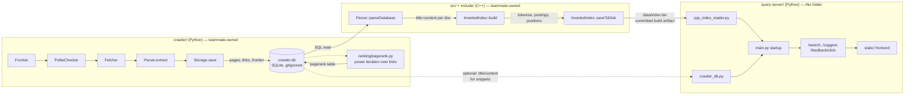
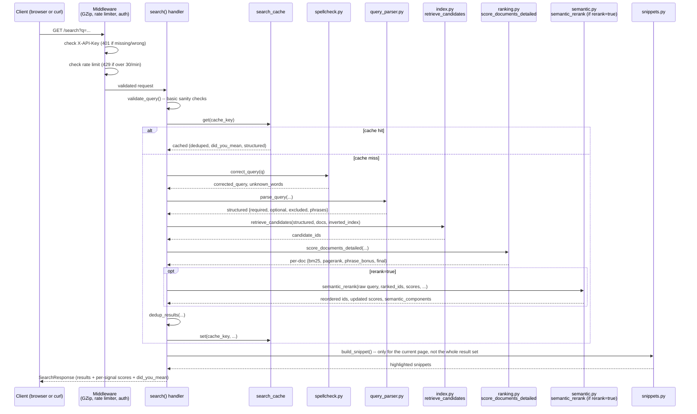
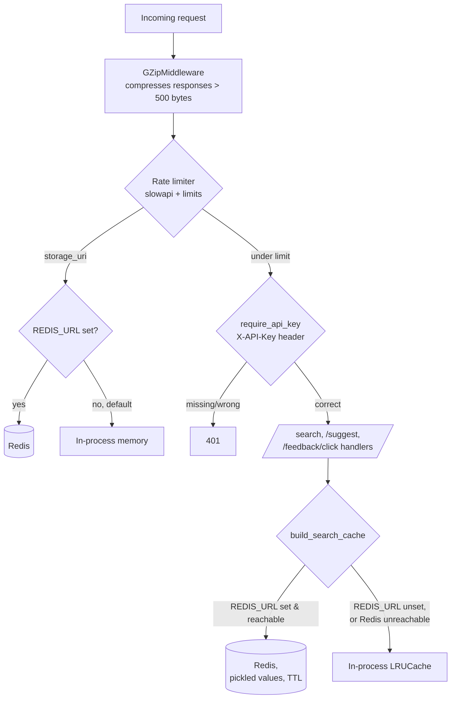
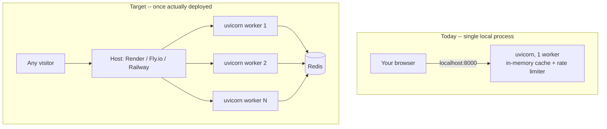

# SDE architecture — how the whole system fits together

This is the structural companion to `overview.md` (who owns what, why) and `current-state.md`
(what's actually verified working right now). This file answers a different question: given
all three components, how does a request actually flow end to end, and what does the system
look like at rest vs. under load. Status/priority calls belong in `roadmap.md`, not here — this
file describes shape, not progress.

## The three components, and the one hard truth about them

**The single fact everything else follows from:** the C++ engine's `InvertedIndex::searchBM25()`
takes exactly one word. It cannot answer a real query. `main.cpp` runs one hardcoded query and
exits — it is not a server, has no HTTP interface, and was never meant to be queried directly.
Everything that makes this a usable search engine — boolean AND/OR/NOT, phrases, multi-term
BM25, spell correction, semantic search, pagination, an HTTP API, a frontend — lives entirely in
`query-server/`. The C++ engine's actual job is narrower than its name suggests: read
`crawler.db`, build a compact on-disk inverted index (`data/index.bin`), and get out of the way.

## What each artifact actually is

| Artifact | Produced by | Consumed by | Committed to git? |
|---|---|---|---|
| `crawler.db` (SQLite: `pages`, `links`, `frontier`, `pagerank`) | `crawler/` | `src/parser.cpp` (build-time), `app/crawler_db.py` (serve-time, optional) | No — gitignored crawl output, lives on whoever ran the crawl's machine |
| `data/index.bin` (binary: postings, positions, doc lengths, URLs, PageRank) | `src/index.cpp`'s `saveToDisk()` | `app/cpp_index_reader.py` — hard startup dependency | **Yes** — committed build artifact |
| Sentence-embedding cache (`data/embeddings_cache_cpp.pkl`) | `app/semantic.py`, built once at startup or loaded from cache | `app/semantic.py`'s `semantic_rerank()` | No — regenerated if stale (keyed against `data/index.bin`'s mtime) |

`index.bin` deliberately does **not** carry page text — it's a word→document mapping, not a
content store. Duplicating full text into it would bloat the index and duplicate `crawler.db`'s
job. This is why `crawler.db`'s absence degrades snippets/spellcheck/embeddings gracefully
instead of breaking search entirely: the index (structure) and the text (content) were always
two separate concerns, read by two separate, independently-optional code paths
(`cpp_index_reader.py` is a hard dependency; `crawler_db.py` is not).

## Request lifecycle: `GET /search?q=...&rerank=...`

Two design choices worth naming explicitly because they're easy to miss just reading the code
top to bottom:

- **Snippets are generated after pagination, not before.** The cache stores the full
  ranked+deduped list; snippet generation (the most expensive per-result step, since it
  re-tokenizes document text) only runs on the ~10 results actually being returned, cache hit
  or miss. This is what keeps a 1,000-candidate query cheap to paginate through.
- **`rerank=true` re-derives retrieval from the raw query, not the spell-corrected one.**
  Fixed in Phase 8 after it was found to bias which documents even entered the reranked pool —
  see `docs-ml/current-state.md` for the full story. The two search modes (`rerank=false` /
  `rerank=true`) are genuinely two different retrieval paths sharing the same scoring code, not
  one path with a toggle at the end.

## Auth and scale layer (Phase 9)

**Current live state, stated plainly:** `REDIS_URL` is unset on this machine, and no Redis
server is installed here. Both the rate limiter and the result cache are running on their
in-memory fallback right now — the Redis code paths exist, are unit-tested against a fake
client, and are ready to activate, but have never been exercised against a real Redis instance.
`/health` and `/` (the frontend) are the only two routes not behind `require_api_key` — a
health check that needs auth is a good way to lock yourself out of your own monitoring, and the
frontend is a static page, not a capability worth gating.

**Why API-key auth, not user accounts:** this system has no per-user state — no saved searches,
no personalization, no login-worthy identity — so there's nothing a username/password pair would
protect that an API key doesn't already. API keys answer "is this caller allowed to hit the API
at all," which is the actual question here. Username/password becomes the right tool the moment
a feature needs a real person behind it (e.g. saved searches, or click history feeding back into
`scripts/train_ranker.py` per-user) — not before.

## Deployment topology: today vs. target

The gap between these two diagrams is almost entirely Group H in `docs-sde/current-state.md`'s
scorecard: no `Dockerfile`, no hosting, no live link. The auth and Redis-readiness work already
done means the *right* diagram doesn't require new application code to reach — just
infrastructure (a real Redis instance, a real host, `API_KEY`/`REDIS_URL` set for real) that
doesn't exist yet.

## What this file deliberately leaves out

- **Byte-level `data/index.bin` format** (magic bytes, section offsets, varint encoding) — that
  level of detail lives in `overview.md`'s "binary format you'll need if this ever needs
  revisiting" section, not duplicated here.
- **Per-item status and ROI-ranked next steps** — `current-state.md` and `roadmap.md`.
- **The query-understanding/ranking pipeline's internal architecture** (parsing grammar,
  BM25/PageRank/semantic fusion, the evaluation harness) — scoped narrowly and covered in
  `docs-ml/architecture.md`, since that's a genuinely ML-framed piece of this same system.
